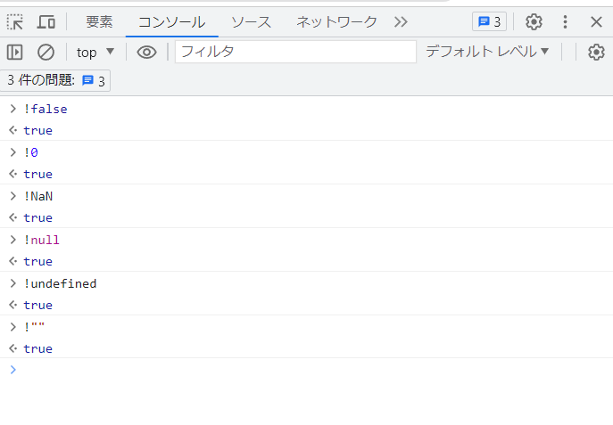

# Javascript基本
## falsyの値とは
JavaScriptにおいて、falsy（偽の）な値とは、条件式でfalseと評価される値のことを指します。  
JavaScriptでは、条件式の結果は常にtrueまたはfalseであるため、非boolean値も暗黙的にbooleanに変換されます。  
Falsyな値は、条件式の結果がfalseとして評価されるため、条件分岐や論理演算において重要な役割を果たします。

JavaScriptにおける主なfalsyな値は以下の通りです：
* false: 明示的にfalseと定義されたboolean値
* 0: 数値の0
* NaN: "Not a Number"を表す特殊な値
* null: 値が存在しないことを示す値
* undefined: 変数が値を持っていないことを示す値
* '' または ""（空の文字列）: 文字列の空文字列

これらの値は、条件式内で使用されるとfalseと評価されます。それ以外のすべての値は、JavaScriptではtruthy（真の）な値と見なされます。つまり、条件式内でそれらの値が評価されるとtrueとなります。

## 試してみよう
Chromeの開発者ツールのコンソールで試せます。  
＊「F12」キーで起動後「コンソール」タブ選択  
「!」は真偽を判定させる演算子です。  
すべての結果が「true」になってるので、上記のものは「false」として処理されることが確認できます。

