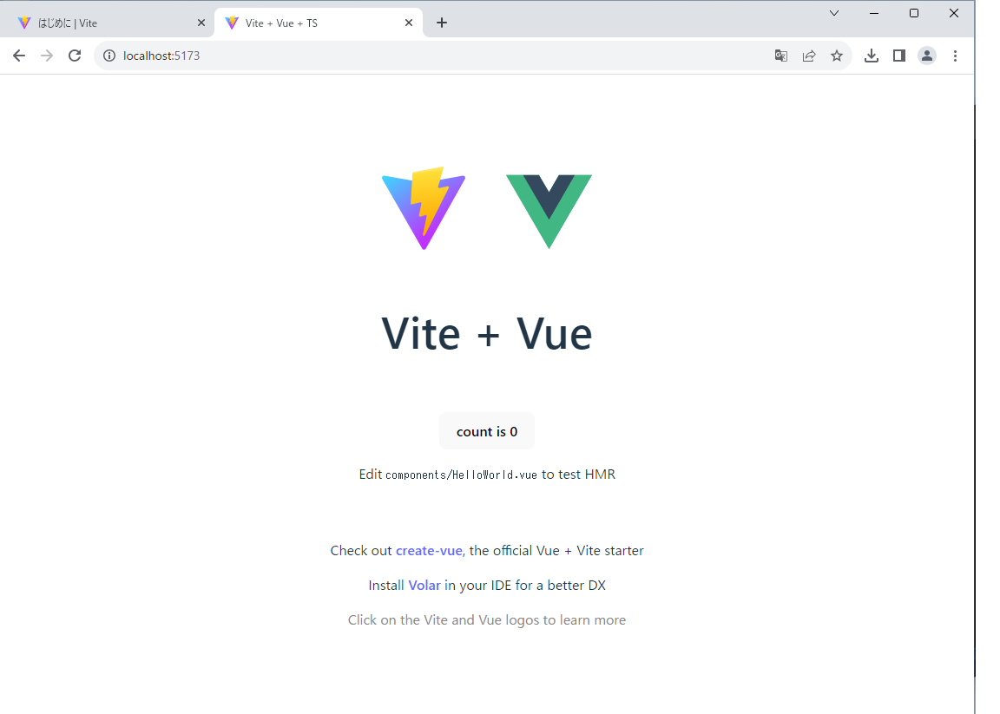
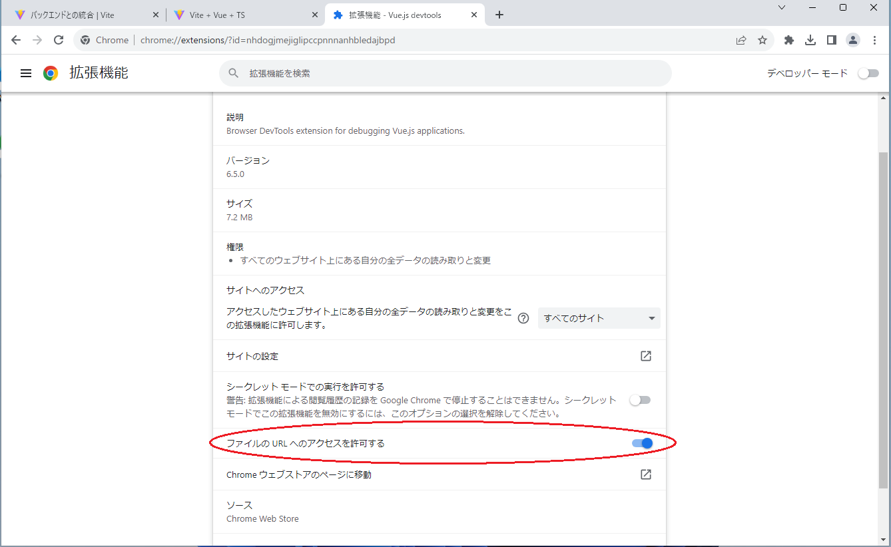
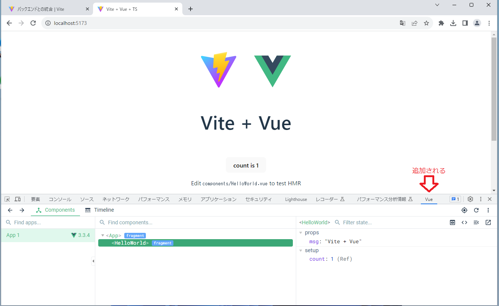

# 環境構築

## Node.js インストール
1. 下記サイトからダウンロードしてインストールしてください。  
   [https://nodejs.org/ja](https://nodejs.org/ja)　＊18系を推奨

1. 確認  
   バージョン表示が行えればインストール成功です。
   ```bash
   $ node -v
   v18.17.0
   ```

## Viteを使ってプロジェクトを作成

1. 「app」プロジェクトを作成してみましょう。
   ```bash
   $ npm create vite@latest -y
   ```
   ```bash
   # 実行結果
   $ npm create vite@latest -y
   Project name: ... app
   Select a framework: » Vue
   Select a variant: » TypeScript
   
   Scaffolding project in C:\Users\Vbox11\app...
   Done. Now run:

   cd app
   npm install
   npm run dev
   ```
2. 作成した「app」プロジェクトを確認する
   ```bash
   # ディレクトリ移動
   $ cd app

   # パッケージ管理ファイル作成
   $ npm install
   added 42 packages, and audited 43 packages in 24s
   4 packages are looking for funding
   run `npm fund` for details

   found 0 vulnerabilities

   # 開発用サーバ起動
   $ npm run dev
   > app@0.0.0 dev
   > vite
   
   VITE v4.4.8  ready in 1418 ms

   ➜  Local:   http://localhost:5173/
   ➜  Network: use --host to expose
   ➜  press h to show help
   ```
   上記の「Local:」をブラウザで開くと表示できます。
   

## ブラウザに拡張機能を追加
1. Vue.jsの開発で便利な拡張機能を追加します。  
   [Vue.js devtools](https://chrome.google.com/webstore/detail/vuejs-devtools/nhdogjmejiglipccpnnnanhbledajbpd?hl=ja)

1. 拡張機能の「ファイルの URL へのアクセスを許可する」をONにします。
   

1. デベロッパーツールに「vue」が追加されます
   
   データやComponentの状態や構造を見ることができるようになります。
