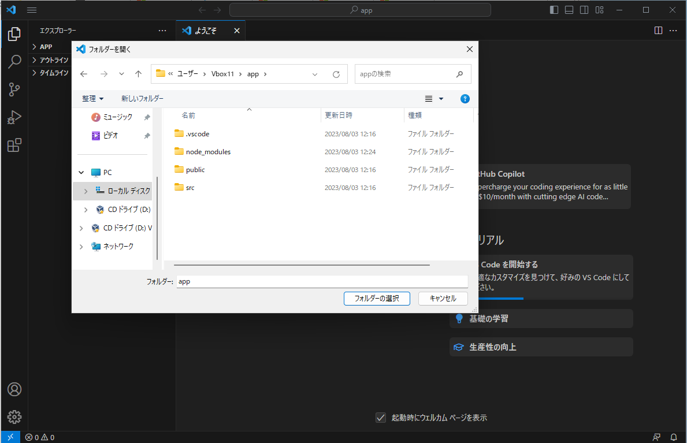
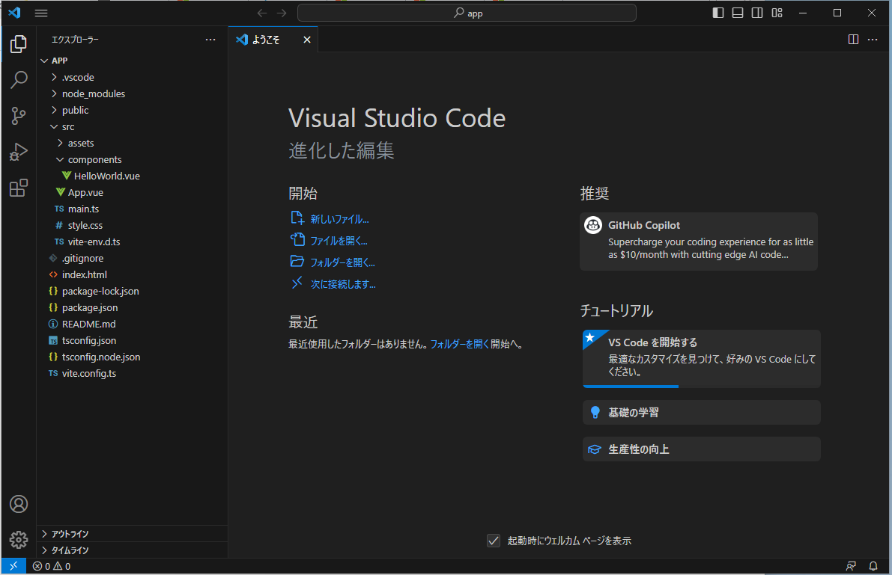

# VSCodeをインストール

Viteで生成されたプロジェクトを見るために、VSCodeをインストールします。

1. ダウンロードしてインストール  
   [VSCode](https://azure.microsoft.com/ja-jp/products/visual-studio-code)

1. 拡張機能追加  
   ** [日本語化](https://marketplace.visualstudio.com/items?itemName=MS-CEINTL.vscode-language-pack-ja)  
   ** [TypeScript Vue Plugin (Volar)](https://marketplace.visualstudio.com/items?itemName=Vue.vscode-typescript-vue-plugin)  
   ** [Vue Language Features (Volar)](https://marketplace.visualstudio.com/items?itemName=Vue.volar)  
   ** [Vetur（これ入らないかも）](https://marketplace.visualstudio.com/items?itemName=octref.vetur)

1. プロジェクトフォルダーを開く
   

1. 一覧が表示される
   
