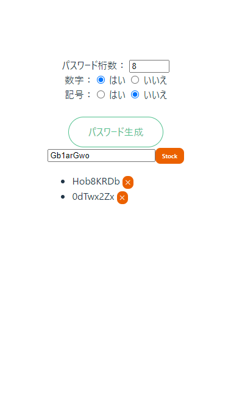

# ハンズオンとしてパスワードジェネレーターを作ってみましょう

コンポーネント化とコンポーネント間のデータのより取りを学ぶための  
ハンズオンになります。

1. パスワード生成ボタンを押すと新しいパスワードを生成
1. stockボタンを押すと下部のリストに保存
1. リストの右端にあるXボタンを押すとリストから削除

完成したソースコードはこちらに置いてありますので、  
先に動かしてみたい方はcloneしてください。

[ソースコード](https://github.com/murcubcc110/vuejs-sample-passwdgen)
